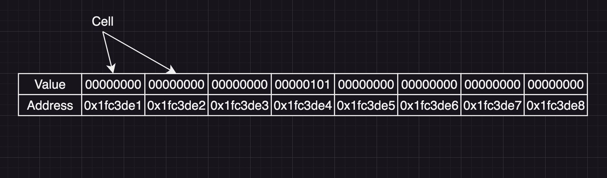

### Pointers

A pointer is the _address_ of something else in memory. Whenever any structure or function or variable is created, it is created _somewhere_ in memory. The value of this _somewhere_ is its address. The size of a pointer is platform dependent. 64-bit architectures have 64-bit (8 byte) pointers. 32-bit architectures have 32-bit (4 byte) pointers. To get the pointer value, use the `&` operator, like so:

##### Example 1.1
```C
#include <stdio.h>

int main() {
    int x = 5; // declare an integer variable
    int *pointer_to_x = &x; // now the variable pointer_to_x contains the address of x in memory
    printf("%p\n", pointer_to_x); // you can print out the address like this if you want to see (%p is the correct format specifier)
    return 0;
}
```

#### Pointer Types

In the above example, we declared a pointer to the integer variable x with the syntax `int *pointer_to_x`. The generalized syntax for this is `<type_name> *<variable_name>`. It should be noted that the alignment of the `*` is personal preference. `<type_name>* <variable_name>` is just as valid. Here's an example of a few pointer types:

##### Example 2.1
```C
int main() {
    char *a; // the variable a is of the type pointer to a character
    short *b; // the variable b is of the type pointer to a short 
    int *c; // the variable c is of the type pointer to an int
    float *d; // the variable d is of the type pointer to a float
    double *e; // the variable e is of the type pointer to a double

    int **f; // the variable f is of the type pointer to an int pointer

    void *g; // the variable g is of the type pointer to void (we will discuss void more later, when we discuss deferencing pointers)
    void **h; // the variable h is of the type pointer to a void pointer (this is insanely useful in the real world)

    return 0;
}
```

So far, we have only seen pointers to primitives, but we can have pointers to anything. For example, here is an example of a pointer to a struct. Don't worry, we will come back to this later if it's confusing.

##### Example 2.2
```C
typedef struct example_struct {
    int x;
    int y;
    int z;
} example_struct;

int main() {
    example_struct *a; // the variable a is of the type pointer to an example struct
    return 0;
}
```

In C++, you can have pointers to classes as well, like so:

##### Example 2.3
```C++

class ExampleClass {
public:
    ExampleClass(){}
private:
    int x_;
    int y_;
    int z_;
};

auto main() -> int {
    ExampleClass *a; // the variable a is of the type pointer to ExampleClass
    return 0;
}
```

#### An Aside About Initialized vs. Uninitialized Memory

In  [Example 1.1](#example-11), the variable `pointer_to_x` is created with the value of `&x`. In [Example 2.1](#example-21), (and also [Example 2.2](#example-22) and [Example 2.3](#example-23)), on the other hand, pointer variables are created but not given a value. We call the variable `pointer_to_x` in [Example 1.1](#example-11) _initialized_ because it has a distinct, known value--the address of the variable `x`. On the other hand, all the variables in [Example 2.1](#example-21) are _uninitialized_ because they are not assigned a value. 

Many programming languages such as Rust do not allow you to (or make it very difficult to) work with uninitialized memory. C and C++, however, have no such qualms. We will discuss uninitialized memory more in the next section. 

#### Dereferencing Pointers

The act of _dereferencing_ a pointer means to _read the value at the address of the pointer_. This _value_ depends on the type of the pointer. To understand what this means, lets first discuss a simplified version of the memory layout of a program and how data is stored.

You can picture memory (for our purposes) as a boundless array of _cells_. Each cell holds exactly one byte. Each cell is addressable. This means that each cell location corresponds to some memory address. Here's an example:


